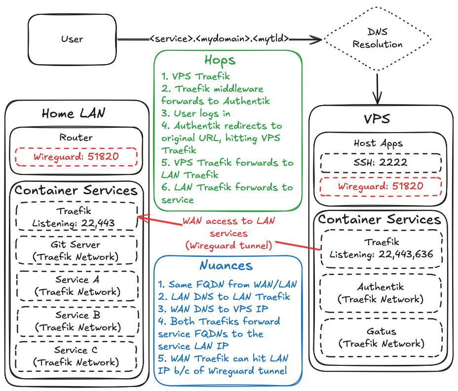

# vps-proxy

Create a VPS that runs

- [Traefik](https://traefik.io/traefik) (reverse proxy) w/ [oidc-auth](https://github.com/sevensolutions/traefik-oidc-auth) plugin
- [Pocket ID](https://github.com/pocket-id/pocket-id) (OIDC identity provider)
- [Gatus](https://gatus.io/) (uptime monitoring and alerting)
- [Tuwunel](https://github.com/matrix-construct/tuwunel) (Matrix homeserver)
- Wireguard tunnel to another network

Automation tasks:

- Creates a firewall and virtual private server (VPS) in Hetzner Cloud
- Installs, configures, and starts Wireguard on the VPS
- Installs Docker on the VPS and executes a docker compose file to spin up docker services

## Overview



## Just tell me how I can use this without being an expert coder

Okay, so you want to have your own Debian server running docker compose services? Easy enough.

You need to already have:

- AWS account with programmatic access (just for the OpenTofu state resources - **all free tier**)
- A Hetzner Cloud account
- MaxMind license key (see link in [Use of Secrets](#use-of-secrets))
- An SSH key pair
- A domain purchased anywhere (I use [porkbun.com](https://porkbun.com/)) but using Cloudflare nameservers

Clone or fork this repo and then do the following:

1. Create an SSH key pair. Or use one you already have.

2. Populate the secrets in your GitHub repo.

3. Add or remove docker services to your preference (within `ansible/roles/deploy/files/docker-compose.yml`). Configure Gatus monitoring in `ansible/roles/deploy/files/gatus/config.yml` and Traefik settings in `ansible/roles/traefik/files/`.

4. Tweak the environment variables as necessary.

5. `cd` into the `tfstate` directory, update `main.tf` to your preference, and apply the Terraform to create an S3 bucket and DynamoDB which will be utilized for the OpenTofu automation state.

6. Commit, push, create a PR, and watch the magic happen!

## Use of Secrets

GitHub Actions needs several environment secrets for CI/CD. Some need to be encrypted - others not really, but I'm encrypted them all anyway.

| Secret Name                        | Purpose                              | How to Generate                                                                                    |
| ---------------------------------- | ------------------------------------ | -------------------------------------------------------------------------------------------------- |
| `VPS_PROXY_KEY`                    | SSH private key for VPS access       | `ssh-keygen -t ed25519`                                                                            |
| `VPS_PROXY_KEY_PUBLIC`             | SSH public key for VPS access        | Generated alongside private key                                                                    |
| `AWS_ACCESS_KEY_ID`                | AWS access key for S3 state backend  | Created in AWS IAM                                                                                 |
| `AWS_SECRET_ACCESS_KEY`            | AWS secret key for S3 state backend  | Created in AWS IAM                                                                                 |
| `HCLOUD_TOKEN`                     | Hetzner Cloud API token              | Generated in Hetzner Cloud Console → Security → API Tokens                                         |
| `TRAEFIK_BASIC_AUTH_USERNAME`      | Traefik dashboard username           | Your chosen username                                                                               |
| `TRAEFIK_BASIC_AUTH_PASSWORD`      | Traefik dashboard password (hashed)  | `echo $(htpasswd -nb user password) \| sed -e s/\\$/\\$\\$/g`                                      |
| `TRAEFIK_OIDC_AUTH_SECRET`         | OIDC authentication secret           | `openssl rand -base64 36`                                                                          |
| `TRAEFIK_OIDC_CLIENT_ID`           | OIDC client identifier for Traefik   | Provided by Pocket ID                                                                              |
| `TRAEFIK_OIDC_CLIENT_SECRET`       | OIDC client secret for Traefik       | Provided by Pocket ID                                                                              |
| `CROWDSEC_TRAEFIK_BOUNCER_API_KEY` | CrowdSec bouncer API key             | `docker exec crowdsec cscli bouncers add traefik-bouncer`                                          |
| `IDM_DOMAIN`                       | FQDN of homelab identity manager     | Your homelab IdM domain (e.g., idm.example.com)                                                    |
| `LAN_SERVICE1`                     | FQDN of homelab service              | Your homelab service1 subdomain (e.g., service1)                                                   |
| `MAXMIND_LICENSE_KEY`              | MaxMind GeoIP license key            | [MaxMind signup](https://www.maxmind.com/en/geolite2/signup)                                       |
| `POCKETID_POSTGRES_USER`           | Pocket ID database username          | Your chosen username                                                                               |
| `POCKETID_POSTGRES_PASSWORD`       | Pocket ID database password          | `openssl rand -base64 32`                                                                          |
| `POCKETID_POSTGRES_DB`             | Pocket ID database name              | Your chosen database name (e.g., pocketid)                                                         |
| `POCKETID_ENCRYPTION_KEY`          | Pocket ID encryption key             | `openssl rand -base64 32`                                                                          |
| `TUWUNEL_ALLOW_REGISTRATION`       | Allow new Matrix user registration   | `true` or `false` (set `true` initially to create first user, then `false`)                        |
| `TUWUNEL_REGISTRATION_TOKEN`       | Token required during registration   | `openssl rand -base64 32` (required when registration is enabled)                                  |
| `TUWUNEL_OIDC_CLIENT_ID`           | OIDC client ID for Matrix SSO        | Provided by Pocket ID (leave empty to disable SSO)                                                 |
| `TUWUNEL_OIDC_CLIENT_SECRET`       | OIDC client secret for Matrix SSO    | Provided by Pocket ID (leave empty to disable SSO)                                                 |
| `SMTP_HOST`                        | SMTP server hostname                 | Your SMTP provider's server (e.g., smtp.gmail.com)                                                 |
| `SMTP_USER`                        | SMTP username                        | Your email address                                                                                 |
| `SMTP_PASSWORD`                    | SMTP password                        | Your email password or app-specific password                                                       |
| `SMTP_TO`                          | Email address for alerts             | Email address to receive notifications                                                             |
| `WIREGUARD_PEER_ENDPOINT`          | WireGuard peer endpoint              | Your home network's public IP or DDNS hostname                                                     |
| `ACME_EMAIL`                       | Email for Let's Encrypt certificates | Your email address                                                                                 |
| `PUBLIC_DOMAIN`                    | Your public domain name              | Your registered domain (e.g., example.com)                                                         |
| `CF_DNS_API_TOKEN`                 | Cloudflare DNS API token             | [Cloudflare API tokens](https://dash.cloudflare.com/profile/api-tokens) with DNS:Edit permissions  |
| `CF_ZONE_API_TOKEN`                | Cloudflare Zone API token            | [Cloudflare API tokens](https://dash.cloudflare.com/profile/api-tokens) with Zone:Read permissions |
| `TZ`                               | Timezone for containers              | IANA timezone (e.g., America/New_York)                                                             |
| `NFS_MOUNTS`                       | NFS shares to mount (JSON array)     | `[{"src":"server.example.com:/path/to/share","path":"/mnt/backup"}]`                               |
| `RESTORE_DATABASES`                | Whether to restore from backup       | `true` or `false`                                                                                  |
| `GH_PAT_SECRETS_WRITE`             | GitHub PAT for workflow automation   | Fine-grained token with Secrets:Read+Write permission (see below)                                  |
| `SERVER_IPV4`                      | VPS IPv4 address                     | Auto-populated by tofu-apply workflow, do not create manually                                      |

### GitHub Personal Access Token (PAT)

The `GH_PAT_SECRETS_WRITE` secret is used by the `tofu-apply` workflow to automatically save the VPS IP address as the `SERVER_IPV4` secret for use by the `deploy` workflow.

**To create a fine-grained PAT:**

1. Go to GitHub Settings → Developer settings → Personal access tokens → **Fine-grained tokens**
2. Click "Generate new token"
3. **Token name**: `VPS-Proxy Workflow - Set Secrets`
4. **Expiration**: No expiration (recommended for infrastructure automation)
5. **Repository access**: Only select repositories → Choose `willquill/vps-proxy`
6. **Repository permissions**:
   - **Secrets**: ✅ Read and write
7. Click "Generate token" and copy it
8. Add it as a repository secret named `GH_PAT_SECRETS_WRITE`

This allows the infrastructure provisioning workflow to persist the VPS IP address indefinitely without artifact retention limits.

### Ansible Secrets

Ensure that every secret in your "Run ansible playbook" task within `.github/workflows/deploy.yml` is also in your GitHub environment secrets, as these secrets are used to populate the values within your Traefik configuration files and more.

### Docker Compose Secrets

See `ansible/roles/deploy/templates/env.j2` for all variables. **_Note: Some of the variables are defined in the GitHub Actions `ansible-playbook` command and others are vars in `ansible/main.yml`_**

### NFS Mounts

On the NFS server itself, I did this:

```sh
mkdir /nvr/backups/vps_proxy
```

```sh
echo "/nvr/backups/vps_proxy 192.168.145.1/32(rw,no_root_squash,no_subtree_check,sync)" >> \
  /etc/exports && sudo systemctl restart nfs-kernel-server
```

On your firewall, make sure the VPS can access 2049/TCP on your NFS server.

The GitHub environment secret `NFS_MOUNTS` should be a list of k/v pairs as seen below.

```sh
[{"src":"10.1.20.20:/nvr/backups/vps_proxy","path":"/mnt/backups"}]
```

## Details

### Routing

Your subdomains will point to your VPS, and Traefik will be listening on 443 so that it may forward your requests to either services hosted within the VPS (via labels on the docker compose services) or to services hosted on your home network (via the file provider, i.e. `services.yml.j2`), as there will be a Wireguard tunnel between the VPS and your home network.

Like this: `https://<your-service>.<your-domain>.<your-tld>` > Traefik on the VPS > Wireguard tunnel to home network > Service hosted at home

In my case, I'm actually forwarding all requests to another Traefik instance running at home, so I have two paths:

```
Internet → VPS-Traefik → WireGuard → LAN-Traefik → Service
LAN → LAN-Traefik → Service
```

### Prepare Terraform State Backend

Instead of storing the Terraform state locally or committing it to GitHub, I'm going to keep mine in AWS S3 and use DynamoDB for state locking. The [terraform-aws-bootstrap](https://github.com/trussworks/terraform-aws-bootstrap) module makes this super easy.

I do this part manually since it is only done once.

`cd` into `./terraform/tfstate`, run "aws configure", enter your key ID and access key for your AWS user, then do `terraform apply`. Why Terraform and not OpenTofu? Because I don't know of a similar module for OpenTofu, and I was too lazy to build it myself.

In sum:

- Terraform will be used _manually_ to create the S3 bucket to store the OpenTofu state and DynamoDB for state locking
- OpenTofu will be used _with GitHub Actions_ to create the Hetzner Cloud resources.

If you did a `tofu apply` before creating your backend, you can migrate your local tfstate file to the remote state by simply executing `tofu init` as follows:

```txt
$ tofu init

Initializing the backend...
Do you want to copy existing state to the new backend?
  Pre-existing state was found while migrating the previous "local" backend to the
  newly configured "s3" backend. No existing state was found in the newly
  configured "s3" backend. Do you want to copy this state to the new "s3"
  backend? Enter "yes" to copy and "no" to start with an empty state.

  Enter a value: yes
```

### Hetzner Cloud

I use Hetzner Cloud, but you can update the files within the `opentofu` directory to provision your VPS elsewhere. You will need to first create a project manually in the [Hetzner console](console.hetzner.com). Then go to Security, upload the SSH key you created, and create an API key for Terraform.

If you use GitHub Actions to deploy, use the ones from this repo. Otherwise, deploy manually in the order seen in the deploy action.

### WireGuard Setup with OPNsense

It's critical to understand this differentiation with how Wireguard may be used:

1. You might run a Wireguard server at home, and you connect to it from your phone or laptop just to access network resources at home.

This is known as a road warrior/mobile client setup, and in the Peer settings on your phone/laptop, you'd do: `AllowedIps = 192.168.1.0/24` or whatever your home subnet is. This makes your phone route traffic _destined to any IP in that range_ go through the Wireguard interface. All other traffic goes through whatever other network interface you have on your device.

2. You might run a Wireguard server at home, and you connect to it from your phone or laptop so that _all internet traffic to/from your phone_ goes through your home's internet connection.

This is another variation of the road warrior/mobile client setup, and you would do: `AllowedIps = 0.0.0.0/0, ::/0` to route all traffic through the Wireguard interface.

3. **For the purpose of this project**, where you want this VPS proxy you've deployed to be able to communicate with your home network but not send all traffic through the tunnel (like general internet traffic), you are essentially doing the road warrior/mobile client setup.

So the Wireguard configuration file on the VPS will have a `Peer` configuration where `AllowedIps = 192.168.145.2/32, 10.1.0.0/16` (my values) because 192.168.154.2 is the Wireguard interface on my home router, and 10.1.0.0/16 is the subnet containing my home subnets (I break that range down into smaller subnets at home).

And the Wireguard configuration file utilized by OPNSense at home would have a Peer configuration where `AllowedIPs = 192.168.154.1/32` - the IP address assigned to the Wireguard interface on the VPS proxy.

The Ansible playbook automatically configures WireGuard on the VPS server. It places a Wireguard configuration into `/etc/wireguard/wg0.conf` that is set to pass all traffic destined to 192.168.154.2/32 or 10.1.0.0/16 through the tunnel.

It also generates `/etc/wireguard/client.conf` which is pre-configured for OPNSense but, unless it can somehow be imported, must have its content copied and pasted into OPNSense as outlined in the next section:

#### Wireguard Configuration

1. On your OPNsense router, navigate to **VPN > WireGuard > Instances**
2. Click **+ Add** to create a new WireGuard peer configuration:

- **Name**: vps-proxy
- **Public Key**: Use the `PublicKey` from the `Peer` in `/etc/wireguard/wg0.conf` on the VPS
- **Private Key**: Use the `PrivateKey` from the `Interface` in `/etc/wireguard/client.conf` on the VPS
- **Listen Port**: I use 51821 because 51820 is already in use in my case
- **Tunnel Address**: 192.168.145.2/24 (must be in same subnet as VPS but different IP)
- **Disable Routes**: Unchecked
- **Peers**: Leave empty for now

3. Navigate to **VPN > WireGuard > Peers**
4. Click **+ Add** to create a new peer:

- **Name**: vps-proxy
- **Public Key**: Use the `PublicKey` from the `Peer` in `/etc/wireguard/client.conf` on the VPS
- **Shared Secret**: Leave blank
- **Allowed IPs**: 192.168.145.1/32
- **Endpoint Address**: Your VPS's public IP address (or DDNS FQDN)
- **Endpoint Port**: 51820
- **Instances**: vps-proxy
- **Keepalive**: 25 (recommended)

5. Navigate to Firewall > Rules > WireGuard (Group)

- **Disable** the allow all rule, save, and apply, if you do not want your VPS to access EVERYTHING in your home network. You will create more specific rules for that.

5. Navigate to **VPN > WireGuard > General**
6. Check **Enable WireGuard** and save

7. Create firewall rule to allow the VPS proxy's public IP to hit your WAN interface:

- Firewall > Aliases > create a new one
- **Name**: vps_proxy_wan_ip
- **Content**: ddns.<yourdomain> (the value you gave to PUBLIC_DOMAIN)
- Diagnostics > Aliases > select the alias and you should see the IP address!
- Firewall > Rules > WAN > create a new one
- **Source**: Alias you just created
- **Destination**: WAN address
- **Port**: 51821

7. Create new interface for the Wireguard tunnel

- Interfaces > Assignments > Assign a new interface
- **Device**: wg1
- **Description**: WG_VPS
- Interfaces > WG_VPS > Enable Interface

8. Allow the VPS proxy to hit internal IPs

- Firewall > Rules > WG_VPS
- Create a new rule
- **Source**: \*
- **Destination**: Whatever you want
- **Port**: Whatever you want

As an initial test, I allow ICMP in the WG_VPS rules to a few destinations at home for testing.

### Testing the Connection

To test if the WireGuard tunnel is working:

1. From VPS: `ping 192.168.145.2`
2. From OPNsense or any host on home network: `ping 192.168.145.1`

You can also check the connection status in OPNsense under **VPN > WireGuard > Status**

### Crowdsec

I followed [this guide](https://blog.lrvt.de/configuring-crowdsec-with-traefik/).

After spinning it up, register an account to get your code and then execute this:

```sh
# enroll security engine by execing into the crowdsec container
docker exec crowdsec cscli console enroll -e context <account-code>
```

The guide then says to create a bouncer token with `docker exec crowdsec cscli bouncers add traefik-bouncer` but wait a sec. A better approach is to use the [Crowdsec Bouncer Traefik plugin](https://plugins.traefik.io/plugins/6335346ca4caa9ddeffda116/crowdsec-bouncer-traefik-plugin).

You'll need to generate a bouncer API key and add it as the `CROWDSEC_TRAEFIK_BOUNCER_API_KEY` GitHub secret:

```sh
docker exec crowdsec cscli bouncers add traefik-bouncer
```

The Ansible playbook automatically writes this key to a file that Traefik's CrowdSec middleware reads via `CrowdsecLapiKeyFile: "/crowdsec-api-key.txt"` in middlewares.yml.

### Pocket ID

To integrate the `traefik-oidc-auth` plugin with a Pocket ID OIDC client, see the plugin [documentation here](https://traefik-oidc-auth.sevensolutions.cc/docs/identity-providers/pocket-id).

It's a little funky because you pass in the `TRAEFIK_OIDC_CLIENT_ID` GitHub secret to the Traefik docker service to be used within the middleware configuration.

Then you use that in a new OIDC client configured in the Pocket ID, and when you click Save, it generates a secret for you. Copy and paste that into a new GitHub secret named `TRAEFIK_OIDC_CLIENT_SECRET` and pass that into the Traefik container (doesn't need to be passed into the Pocket ID container.) This means **running another GitHub workflow** to execute the Ansible playbook to populate the values in `.env` - or just manually populate the `.env` in the VPS and recreate the Traefik container.

Any service that you want to protect with Pocket ID that doesn't natively support OIDC can be used with this plugin, and you will need **one callback URL per service** in the OIDC client information for this plugin within Pocket.

#### Protecting the Traefik Dashboard with OIDC

To protect the Traefik dashboard with Pocket ID authentication, you need to understand Traefik's internal services:

- **`api@internal`** - Provides both the dashboard UI (`/dashboard/`) AND API endpoints (`/api/*`)
- **`dashboard@internal`** - Provides ONLY the dashboard UI (`/dashboard/`)

**Why guides sometimes separate them:**

Some guides create two separate routers because the OIDC callback endpoint (`/oidc/callback`) must be routed to a service for the plugin to work. They split it like:

1. `dashboard` router → `dashboard@internal` - handles the UI
2. `dashboard-api` router → `api@internal` - handles `/api` paths and `/oidc/callback`

**For this project's setup:**

Since we use `api@internal` (which includes everything), we only need ONE router. The single router at `tvps.${PUBLIC_DOMAIN}` matches ALL paths including `/oidc/callback`, so the OIDC flow works correctly. The `public-pocket@file` middleware chain in the docker-compose labels applies the OIDC authentication.

### Tuwunel (Matrix Homeserver)

[Tuwunel](https://github.com/matrix-construct/tuwunel) is a lightweight, actively maintained Matrix homeserver written in Rust. It is the successor to [conduwuit](https://github.com/girlbossceo/conduwuit) (itself a fork of [Conduit](https://conduit.rs/)), with native SSO/OIDC support, built-in sliding sync, and an embedded RocksDB database (no external database required).

#### DNS Records

Create the following DNS record pointing to your VPS:

| Type       | Name     | Value                        |
| ---------- | -------- | ---------------------------- |
| A or CNAME | `matrix` | Your VPS IP or DDNS hostname |

Your Matrix server will be accessible at `matrix.<your-domain>`, and Matrix user IDs will be `@user:matrix.<your-domain>`.

#### GitHub Secrets

| Secret                       | Purpose                            | Value                                              |
| ---------------------------- | ---------------------------------- | -------------------------------------------------- |
| `TUWUNEL_ALLOW_REGISTRATION` | Controls open registration         | `true` or `false`                                  |
| `TUWUNEL_REGISTRATION_TOKEN` | Token required during registration | `openssl rand -base64 32`                          |
| `TUWUNEL_OIDC_CLIENT_ID`     | OIDC client ID for Matrix SSO      | Provided by Pocket ID (leave empty to disable SSO) |
| `TUWUNEL_OIDC_CLIENT_SECRET` | OIDC client secret for Matrix SSO  | Provided by Pocket ID (leave empty to disable SSO) |

#### Post-Deployment Setup

Choose one of the two authentication paths below, then follow the common steps.

##### Option A: With Pocket ID (OIDC/SSO)

Tuwunel has native SSO/OIDC support. When configured with Pocket ID, users log in via your Pocket ID instance instead of Matrix passwords. The first user to register through SSO is automatically granted server admin privileges.

1. **Create a new OIDC client in Pocket ID:**
   - Navigate to your Pocket ID admin panel at `https://id.<your-domain>`
   - Create a new OIDC client
   - **Name**: Tuwunel Matrix (or your preference)
   - **Callback URLs**: `https://matrix.<your-domain>/_matrix/client/unstable/login/sso/callback/<your-client-id>` (replace `<your-client-id>` with the Client ID shown in Pocket ID)
   - **Logout Callback URLs**: `https://matrix.<your-domain>`
   - **Public Client**: Unchecked
   - **PKCE**: Unchecked
   - Save and copy the generated **Client ID** and **Client Secret**

2. **Create the GitHub secrets:**
   - `TUWUNEL_OIDC_CLIENT_ID`: The client ID you chose above
   - `TUWUNEL_OIDC_CLIENT_SECRET`: The secret generated by Pocket ID
   - `TUWUNEL_ALLOW_REGISTRATION`: `true` (SSO users are auto-registered on first login)
   - `TUWUNEL_REGISTRATION_TOKEN`: Generate with `openssl rand -base64 32`

3. **Deploy the stack** via GitHub Actions or manually.

4. **Log in with a Matrix client** (see [Recommended Clients](#recommended-matrix-clients)). Set the homeserver to `https://matrix.<your-domain>`. The client will show an SSO login button that redirects to Pocket ID. The first user to log in becomes the server admin.

5. **Optionally disable direct registration** by setting `TUWUNEL_ALLOW_REGISTRATION` to `false` and redeploying. SSO-based registration will still work — this only affects username/password registration.

##### Option B: Without OIDC (Password Only)

If you prefer not to use SSO, leave `TUWUNEL_OIDC_CLIENT_ID` and `TUWUNEL_OIDC_CLIENT_SECRET` empty. Users will authenticate with Matrix username/password directly against the homeserver.

1. **Create the GitHub secrets:**
   - `TUWUNEL_ALLOW_REGISTRATION`: `true`
   - `TUWUNEL_REGISTRATION_TOKEN`: Generate with `openssl rand -base64 32`
   - `TUWUNEL_OIDC_CLIENT_ID`: Leave empty
   - `TUWUNEL_OIDC_CLIENT_SECRET`: Leave empty

2. **Deploy the stack** via GitHub Actions or manually.

3. **Create your admin account** using a Matrix client (see [Recommended Clients](#recommended-matrix-clients)). Connect to `https://matrix.<your-domain>` and register a new account. You will need the registration token you created above. The first user registered is automatically granted admin privileges and will join the Admin Room. If the first user logs in via PocketID, they won't be in the Admin Room. So I recommend that you first create an account named `admin` using the token registration method.

After that, you can login with PocketID authentication as your preferred user to create the user in your homeserver. Then login to your admin account, go to the Admin Room, and invite your preferred user. You may then deactivate your temporary `admin` user (or just keep it).

Since your PocketID user will not have a password, and since a password is required to federate with any other Matrix homeserver, I recommend entering the following command for each PocketID user so that they may reset their password:

```
!admin users reset_password @willquill:matrix.rakara.net
```

This will output a new generated password. That user can then go to "change password", enter the generated password as the current password, and set their own password.

4. **Disable open registration** by setting `TUWUNEL_ALLOW_REGISTRATION` to `false` and redeploying.

5. **Create additional users** (after disabling registration) via the admin room. **This is only necessary for users that won't use PocketID.** Send this message in `#admins:matrix.<your-domain>`:

   ```
   @tuwunel:matrix.<your-domain> create_user <username> <password>
   ```

##### Common Post-Setup Steps

6. **Verify federation** (optional) at the [Matrix Federation Tester](https://federationtester.matrix.org/) by entering `matrix.<your-domain>`.

7. **Manage your server** via the admin room `#admins:matrix.<your-domain>`. Send `@tuwunel:matrix.<your-domain> help` to see available commands.

#### Federation

Tuwunel supports federation out of the box. The `TUWUNEL_WELL_KNOWN` environment variable is configured to advertise the server at `matrix.<your-domain>:443`, so other Matrix servers will discover and connect to it automatically.

If you want Matrix user IDs to use your base domain (e.g., `@user:<your-domain>` instead of `@user:matrix.<your-domain>`), you need to serve `.well-known/matrix/server` and `.well-known/matrix/client` files on your base domain. This requires additional configuration (e.g., an nginx container or Cloudflare Workers) that is beyond the scope of this default setup.

#### Recommended Matrix Clients

| Client                                         | Platform                   | Notes                                                                                   |
| ---------------------------------------------- | -------------------------- | --------------------------------------------------------------------------------------- |
| [Element](https://element.io/)                 | Android, iOS, Web, Desktop | Most mature and feature-complete. Recommended for most users. Supports SSO login.       |
| [Element X](https://element.io/labs/element-x) | Android, iOS               | Next-gen Element client with improved performance and sliding sync. Supports SSO login. |
| [FluffyChat](https://fluffychat.im/)           | Android, iOS, Web, Desktop | Simple, intuitive, and beginner-friendly. Supports SSO login.                           |
| [SchildiChat](https://schildi.chat/)           | Android, Desktop, Web      | Element fork with a more traditional IM experience. Supports SSO login.                 |

When configuring a client, set the homeserver URL to `https://matrix.<your-domain>`. If SSO is configured, the client will display an SSO login button alongside the password option.

## Development

Use [nektos/act](https://github.com/nektos/act) to test GitHub Actions locally - big time saver!

Here's a [helpful gist with example usages of the deb822_repository Ansible module](https://gist.github.com/roib20/27fde10af195cee1c1f8ac5f68be7e9b)

### Troubleshooting

See the values of the Gatus container envvars:

```sh
docker inspect gatus | jq '.[0].Config.Env'
```

### Local testing

When testing with Ansible, do the following:

```sh
ansible-galaxy install -r galaxy-requirements.yml
```

And then run the `ansible-playbook` command found in the workflow but replace the variables with your own (unless you use nektos/act).

### Remote testing

For testing configuration changes directly on the VPS:

1. **Make changes** on the VPS to configuration files.
2. **Pull changes locally**: `./scripts/sync-from-vps.sh` (update `VPS_IP` in script first)
3. **Review changes**: `git diff ansible/roles/`
4. **Commit** if satisfied, or **push changes back**: `./scripts/sync-to-vps.sh`

## Delete runs from GitHub Actions

```sh
gh run list --repo willquill/vps-proxy --limit 500 --json databaseId -q '.[].databaseId' | while read id; do gh run delete "$id" --repo willquill/vps-proxy; done
```

## LICENSE

Distributed under the MIT License. See LICENSE for more information.
